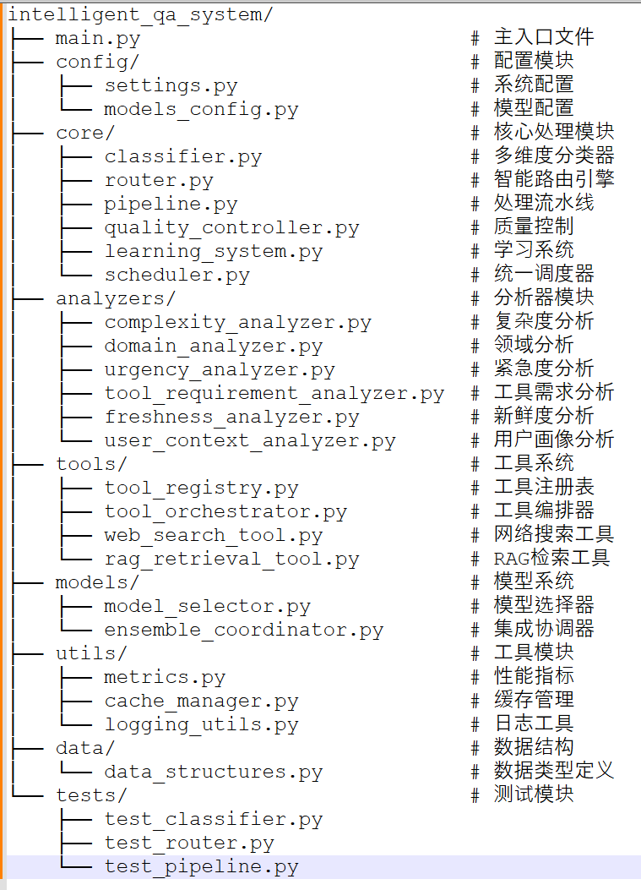

智能问答系统 (Intelligent Q&A System)
一个基于多维度分析和智能路由的高级问答系统，支持动态模型选择、工具编排、质量控制和持续学习。

🌟 主要特性
多维度智能分类：分析问题复杂度、领域、紧急程度等多个维度

智能路由决策：根据分析结果动态选择最优处理路径

工具编排系统：支持搜索、RAG检索、计算、翻译等多种工具

模型集成协调：支持单模型和多模型协作推理

自适应质量控制：多层次验证和自动改进机制

动态学习优化：从交互中学习并持续优化策略


📁 项目结构

🚀 快速开始
环境要求
Python 3.8+
依赖包：aiohttp, jieba
安装依赖
bash
 
pip install aiohttp jieba
启动系统
bash
 
# 进入项目目录
cd intelligent_qa_system

# 启动系统
python main.py
基本使用
启动后，系统将进入交互模式：

 
请输入您的问题 (输入 'quit' 退出): 什么是机器学习？

回答: 基于知识和工具的综合回答: 问题: 什么是机器学习？...
置信度: 0.80
处理时间: 2.35秒
📋 测试
 单元测试

```bash
 
# 测试分类器
python -m pytest tests/test_classifier.py -v

# 测试路由器
python -m pytest tests/test_router.py -v

# 测试流水线
python -m pytest tests/test_pipeline.py -v

#  所有测试
python -m pytest tests/ -v
```
测试示例
1. 简单问题测试
```python
问题: "什么是Python?"
预期: 复杂度级别 ≤ 2, 使用快速路由, 响应时间 < 5秒
```
2. 复杂问题测试
```python
 
 
问题: "请详细分析深度学习中的注意力机制原理"
预期: 复杂度级别 ≥ 3, 使用综合路由, 调用多个工具
```

3. 紧急问题测试
```python
 
 
问题: "紧急！服务器宕机了，如何立即恢复？"
预期: 紧急度 = high, 使用快速通道, 优先级处理
```
4. 工具需求测试
```python
 
问题: "请搜索最新的AI发展趋势并计算相关数据"
预期: 调用搜索工具和计算工具, 并行执行
🔧 核心文件说明
核心处理模块 (core/)
classifier.py - 多维度分类器
作用: 分析输入问题的多个维度特征
算法处理:

复杂度分析: 词汇复杂度 + 语法复杂度 + 语义复杂度 + 推理深度 + 知识广度
领域识别: 基于关键词匹配和权重计算，支持技术、科学、医学、商业等领域
紧急度判定: 时间敏感性分析 + 行动类型分析 + 上下文紧急度
工具需求预测: 基于问题内容识别需要的工具类型和执行策略
router.py - 智能路由引擎
作用: 根据分类结果选择最优处理路径
算法处理:

候选路由生成: 基于问题特征生成多个处理方案
路由评估: 质量预测 + 时间估算 + 资源成本 + 风险评估
最优选择: 综合评分算法选择最佳路由
动态适应: 根据系统负载和性能调整路由策略
pipeline.py - 处理流水线
作用: 执行完整的问题处理流程
算法处理:

阶段式处理: 预处理 → 知识检索 → 工具调用 → 推理合成 → 验证 → 后处理
并行执行: 支持多工具并行调用和结果整合
错误处理: 失败重试和降级机制
结果整合: 多源信息融合和一致性检查
quality_controller.py - 质量控制器
作用: 多层次质量验证和改进
算法处理:

基础质量检查: 长度、结构、连贯性验证
事实准确性: 与知识源对比验证
一致性检查: 多源信息一致性分析
完整性评估: 问题覆盖度分析
置信度计算: 综合多个指标的置信度评分
分析器模块 (analyzers/)
complexity_analyzer.py - 复杂度分析器
```
算法:

```python
 
 
复杂度 = 词汇复杂度×0.1 + 语法复杂度×0.2 + 语义复杂度×0.3 + 推理深度×0.25 + 知识广度×0.15
基于jieba分词进行词汇分析
语法结构复杂度通过从句、连接词识别
语义复杂度通过专业术语密度计算
domain_analyzer.py - 领域分析器
算法:

关键词匹配: 预定义领域关键词库匹配
权重计算: 关键词长度加权、频次加权、位置加权
跨领域检测: 多领域关键词共现分析
置信度评估: 基于匹配度和领域特异性
urgency_analyzer.py - 紧急度分析器

```
算法:

```python
 
 
紧急度 = 关键词紧急度×0.4 + 时间敏感性×0.3 + 行动类型×0.2 + 上下文紧急度×0.1
时间指示词分析（立即、马上、现在等）
行动紧急性分类（解决、修复 vs 学习、了解）
上下文线索识别（问题、故障、错误等）
工具系统 (tools/)
tool_orchestrator.py - 工具编排器
算法处理:

依赖分析: 构建工具依赖图，识别前置条件
执行规划: 拓扑排序确定执行顺序
并行识别: 识别可并行执行的工具组
结果整合: 多工具结果的智能融合
rag_retrieval_tool.py - RAG检索工具

```
算法:

语义匹配: 基于embedding的相似度计算
混合检索: 关键词检索 + 语义检索
结果排序: 相关性评分 + 新鲜度加权
阈值过滤: 置信度阈值过滤低质量结果
模型系统 (models/)
model_selector.py - 模型选择器
算法:

```python
 
模型评分 = 复杂度匹配×0.25 + 性能得分×0.5 + 优先级得分×0.25
复杂度匹配: 问题复杂度与模型适用范围匹配度
性能评分: 历史质量、速度、可靠性综合评分
动态调整: 基于实时性能反馈调整权重
ensemble_coordinator.py - 集成协调器
```
算法:
```
加权投票: 基于模型性能的动态权重分配
一致性分析: 多模型响应的相似度计算
结果融合: 主回答 + 补充信息的智能整合
置信度计算: 基于模型一致性和个体置信度
🔄 系统工作流程
问题接收 → 多维度分析 (6个分析器并行分析)
路由决策 → 生成候选路由 → 评估选择最优路由
流水线执行 → 按阶段执行 (支持并行) → 工具调用 → 模型推理
质量控制 → 多层验证 → 改进建议 → 可选的重新处理
学习反馈 → 记录交互数据 → 模式学习 → 策略优化
📊 性能特性
响应时间: 简单问题 < 5秒，复杂问题 < 30秒
并发处理: 支持多用户并发访问
缓存机制: 智能缓存提升响应速度
负载均衡: 动态资源分配和负载控制
容错机制: 多级降级和错误恢复
```

🔧 配置说明
主要配置在 config/settings.py:

```python
 
 
# API配置
API_KEY = "your-api-key"
BASE_URL = "your-api-base-url"

# 性能阈值
COMPLEXITY_THRESHOLDS = {0: {...}, 1: {...}, ...}
QUALITY_THRESHOLDS = {"min_confidence": 0.7, ...}

# 缓存设置
CACHE_SETTINGS = {"ttl": 3600, "max_size": 1000}
```

📝 扩展开发
系统采用模块化设计，可以轻松扩展：

添加新分析器: 继承基类实现 analyze() 方法
添加新工具: 继承 BaseTool 实现 execute() 方法
添加新模型: 在 models_config.py 中配置新模型
自定义路由策略: 在路由引擎中添加新的路由模板
🤝 贡献
欢迎提交 Issues 和 Pull Requests 来改进项目！

📄 许可证
MIT License